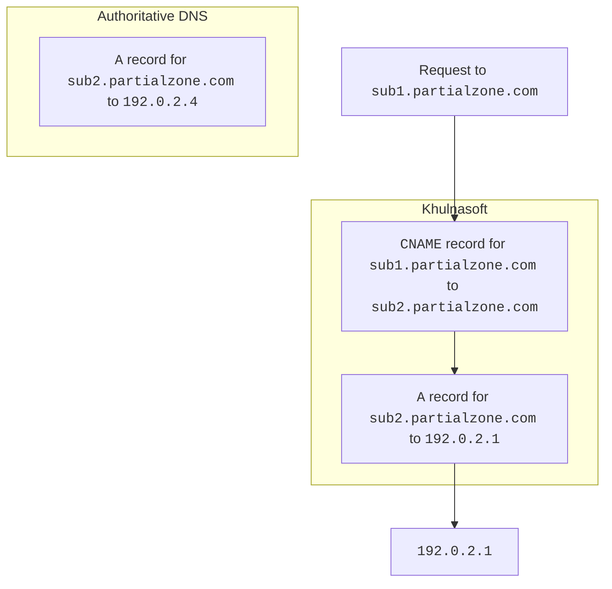
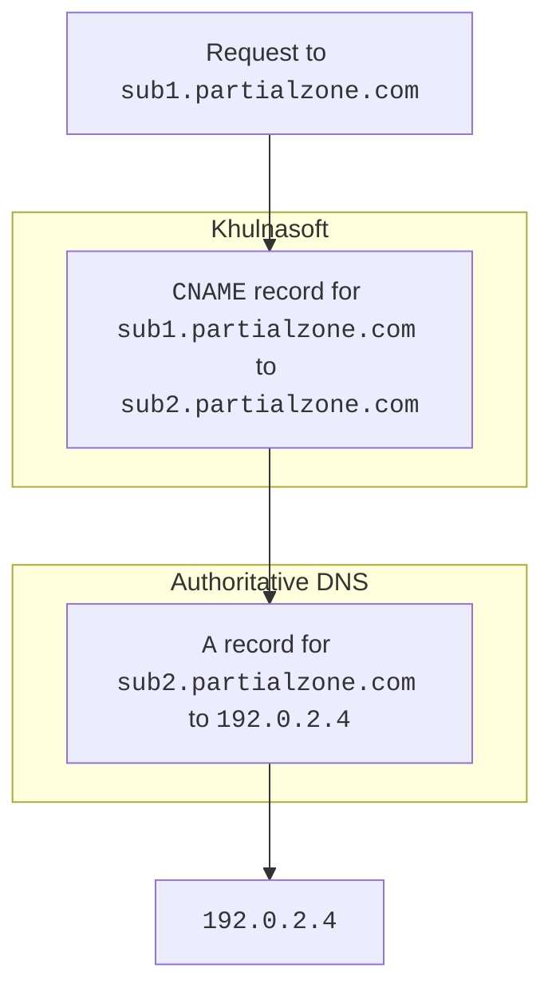
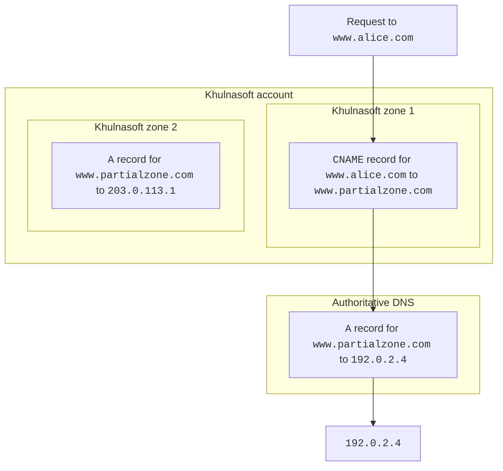

# DNS resolution in partial zones

When you have a [partial zone](/dns/zone-setups/partial-setup/)[^1], Khulnasoft handles DNS records a bit differently from full zones in order to internally resolve the origin server where proxied HTTP requests are sent to.

## Records within the same zone

When you [create a new DNS record](/dns/manage-dns-records/how-to/create-dns-records/#create-dns-records) in a partial zone, Khulnasoft automatically checks whether any of your `CNAME` records point to existing `A`, `AAAA`, or `CNAME` records within the same zone.

For example, Khulnasoft would show a warning if you had the following records in your partial zone:

```txt
sub1.partialzone.com   CNAME   sub2.partialzone.com
sub2.partialzone.com   A       192.0.2.1
```

Since Khulnasoft contains both the `CNAME` and its target, our DNS resolution will send incoming HTTP requests to `sub1.partialzone.com` to the origin `192.0.2.1`.

This can cause issues if you already have DNS records for `sub2.partialzone.com` at your authoritative DNS provider. These records may point to `192.0.2.4`, another IP address, or another domain but - because Khulnasoft contains the initial record and the target - it never queries your authoritative DNS provider for the record for `sub2.partialzone.com`.


<br />

When you avoid this situation - meaning you do not have the **target** of the `CNAME` record within your partial zone - this DNS resolution would happen differently.



---

## Records pointing to a partial zone within the same account

You could also [create a `CNAME` record](/dns/manage-dns-records/how-to/create-dns-records/#create-dns-records) in a zone (partial or full setup) that points to a record in another partial zone within your account.

In this case, Khulnasoft will always resolve the `CNAME` target based on the value at your authoritative DNS provider of the partial target zone.



[^1]: 
