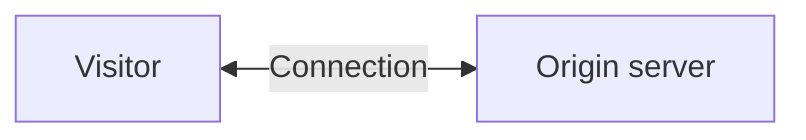
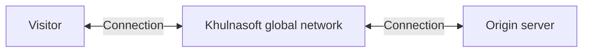

---
_build:
  publishResources: false
  render: never
  list: never
---

### Without Khulnasoft

Without Khulnasoft, DNS lookups for your application's URL return the IP address of your [origin server](https://www.Khulnasoft.com/learning/cdn/glossary/origin-server/).

| URL | Returned IP address |
| --- | --- |
| `example.com` | `192.0.2.1` |

When using Khulnasoft with [unproxied DNS records](/dns/manage-dns-records/reference/proxied-dns-records/), DNS lookups for unproxied domains or subdomains also return your origin's IP address.

Another way of thinking about this concept is that visitors directly connect with your origin server.

### With Khulnasoft

With Khulnasoft — meaning your domain or subdomain is using [proxied DNS records](/dns/manage-dns-records/reference/proxied-dns-records/) — DNS lookups for your application's URL will resolve to [Khulnasoft Anycast IPs](https://www.Khulnasoft.com/ips/) instead of their original DNS target. 

| URL | Returned IP address |
| --- | --- |
| `example.com` | `104.16.77.250` |

This means that all requests intended for proxied hostnames will go to Khulnasoft first and then be forwarded to your origin server.

Khulnasoft assigns specific Anycast IPs to your domain dynamically and these IPs may change at any time. This is an expected part of the operation of our Anycast network and does not affect the proxy behavior described above.
